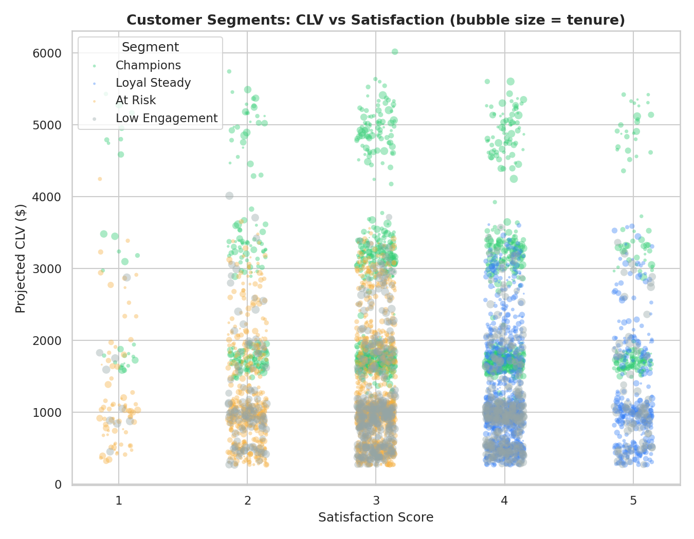
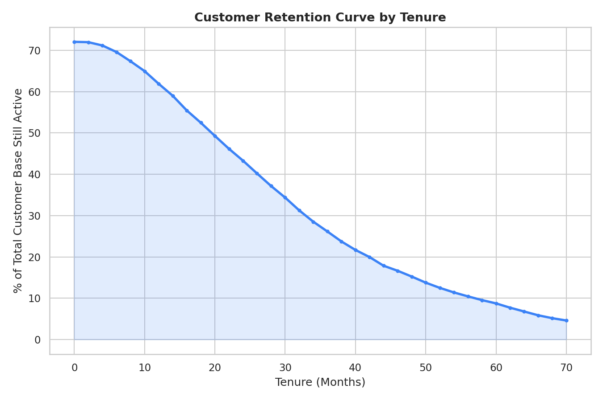
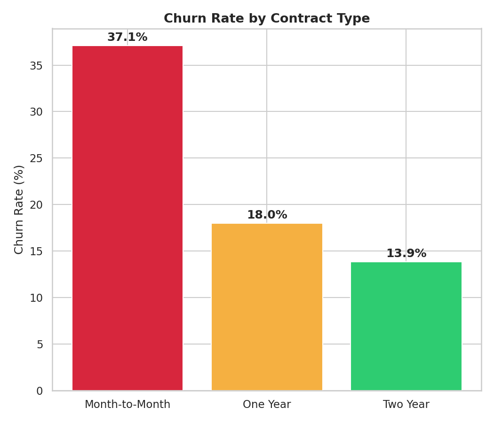
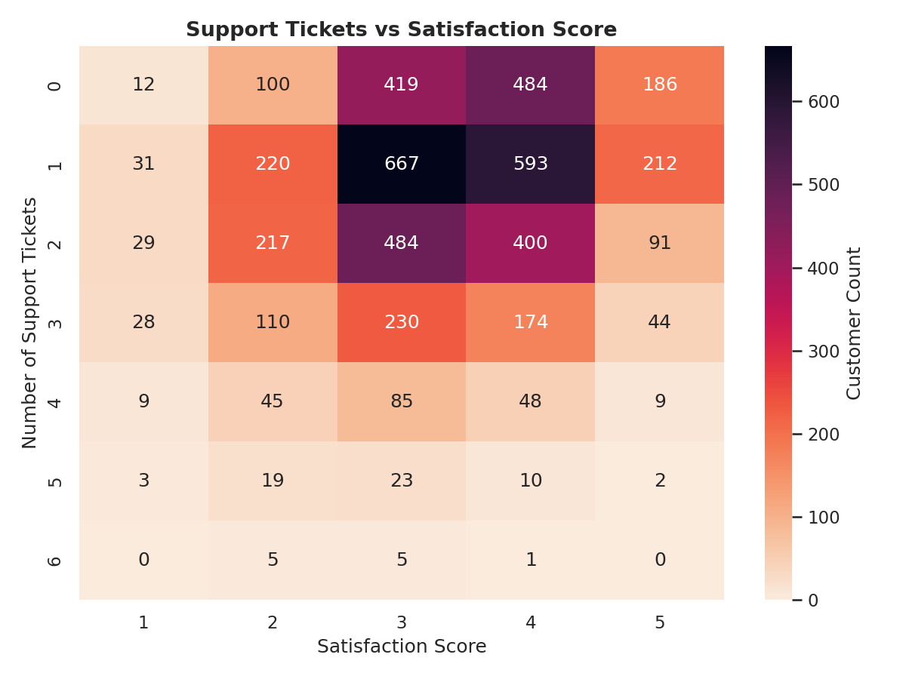
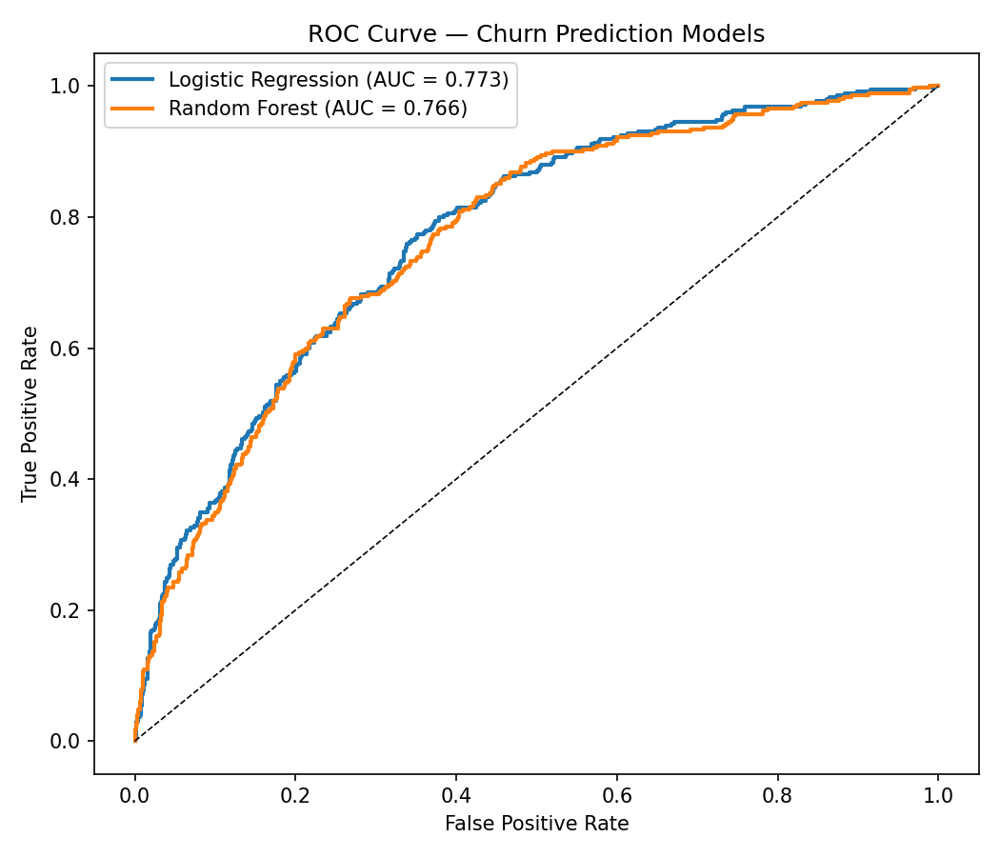
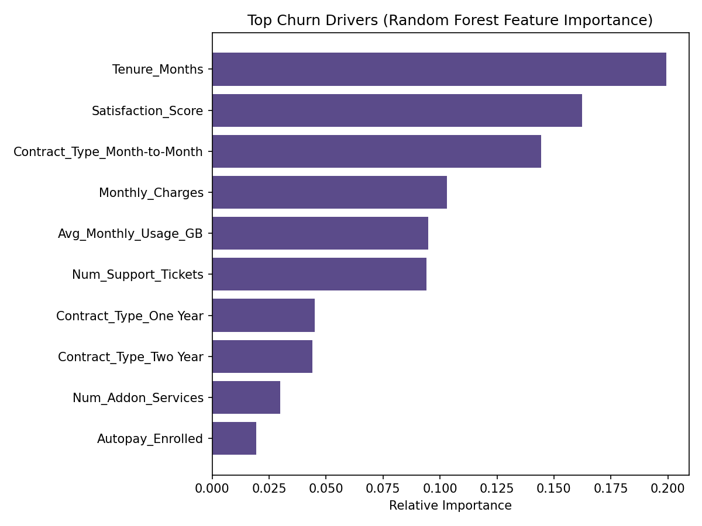
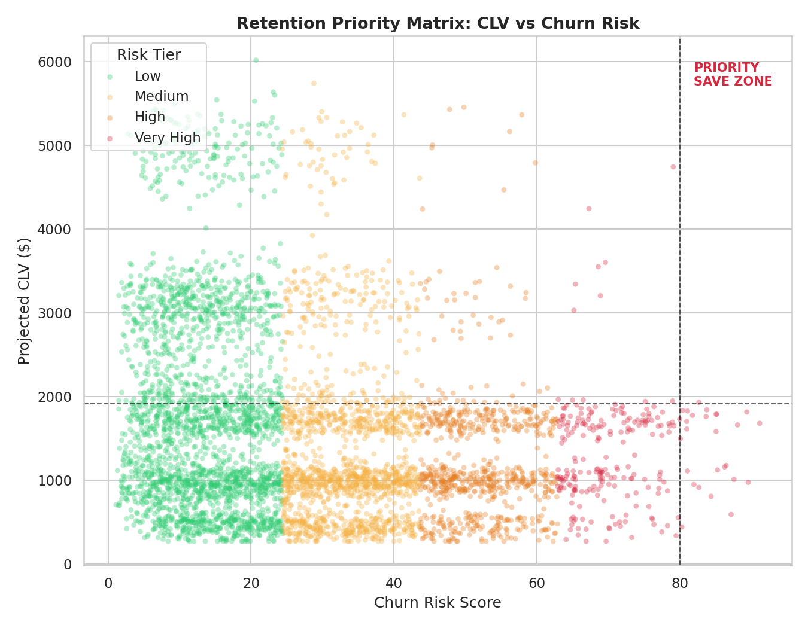

# Customer Churn & Lifetime Value Analytics

**Author: Yashi Singh**

## Project Overview
An end-to-end churn and retention analytics pipeline for a subscription
business: customer segmentation, projected Customer Lifetime Value (CLV),
a churn prediction model, and a **Retention Priority Matrix** that
identifies exactly which customers a retention team should act on first —
high-value customers who are also high churn risk.

Built using:
- Python (pandas, scikit-learn, seaborn, matplotlib) — data generation, segmentation, modeling
- Power BI (DAX) — interactive retention dashboard

---

## Dataset
A synthetic 5,000-customer subscription dataset (`data/subscription_customer_dataset.csv`)
with realistic relationships between contract type, billing, usage,
support interactions, satisfaction, and churn outcome (see
`python/01_generate_dataset.py`).

Overall churn rate: **27.9%** — consistent with typical telecom/SaaS
subscription benchmarks.

---

## Customer Segmentation
Customers were clustered (KMeans, 4 segments) on tenure, monthly spend,
usage, and satisfaction, then labeled by business profile:

| Segment | Avg CLV | Churn Rate |
|---|---|---|
| Champions | $2,679 | 33.5% |
| Loyal Steady | $1,223 | 19.0% |
| At Risk | $1,229 | 36.2% |
| Low Engagement | $1,166 | 17.6% |

**Notable finding:** Champions (premium-tier, highest CLV) churn at a
*higher* rate than Loyal Steady customers — high spend doesn't imply
loyalty. This is exactly the kind of counterintuitive insight that
justifies a dedicated retention priority system rather than targeting
retention spend by segment size alone.



---

## Retention Curve


Retention drops off sharply in the first 20 months, then levels into a
long tail — the first-20-month window is where retention intervention
has the most leverage.

---

## Churn Drivers

**Churn by contract type** — month-to-month customers churn at more than
2.6x the rate of two-year contract customers:



**Support tickets vs satisfaction** — churned customers cluster in the
high-ticket, low-satisfaction corner, confirming support experience is a
leading churn indicator rather than just a lagging complaint metric:



---

## Churn Prediction Model
Logistic Regression and Random Forest were trained and compared:

| Model | ROC-AUC |
|---|---|
| Logistic Regression | 0.773 |
| Random Forest | 0.766 |

Logistic Regression was selected for its interpretability advantage in a
retention-decisioning context.




---

## Retention Priority Matrix
The core business deliverable: every customer gets a `Churn_Risk_Score`
(0-100) and a `Projected_CLV`. Customers in the top CLV quartile **and**
top churn-risk tiers are flagged `Priority Save` — the customers worth
proactive retention outreach.



- **74 customers** flagged Priority Save
- **$219,257** in projected CLV concentrated in that group
- This reframes retention from "reduce churn %" (vague) to "protect this
  specific $219K of at-risk revenue" (actionable)

---

## Power BI Dashboard
See `powerbi/POWERBI_SETUP_GUIDE.md` for full DAX measures and build guide.
Structure:
1. **Executive Overview** — churn rate, CLV, segment mix
2. **Retention Priority** — interactive priority matrix + Priority Save call-list
3. **Customer Segments** — segment profiles and behavior
4. **Churn Drivers** — model insights and contributing factors

---

## Key Insights
- Contract type is the single strongest churn lever — converting
  month-to-month customers to annual contracts is the highest-leverage
  retention action available.
- High CLV does not imply low churn risk — Champions segment churns
  faster than Loyal Steady, so retention spend should be targeted by the
  CLV-x-risk matrix, not by segment size.
- Support ticket volume combined with low satisfaction is an early-warning
  signal that precedes churn and can be monitored proactively rather than
  reactively.

---

## Skills Demonstrated
- Customer segmentation (KMeans clustering)
- Customer Lifetime Value modeling
- Predictive modeling (Logistic Regression, Random Forest) and evaluation (ROC-AUC)
- Business-prioritization frameworks (CLV x risk matrix)
- Business intelligence reporting (Power BI, DAX)

---

## Repository Structure
```
├── data/
│   ├── subscription_customer_dataset.csv
│   ├── segmented_customer_dataset.csv
│   └── scored_customer_dataset.csv
├── python/
│   ├── 01_generate_dataset.py
│   ├── 02_clv_and_segmentation.py
│   ├── 03_churn_model.py
│   └── 04_visualizations.py
├── powerbi/
│   ├── Churn_CLV_Dashboard.pbix   (build using the setup guide)
│   └── POWERBI_SETUP_GUIDE.md
├── screenshots/
└── README.md
```
